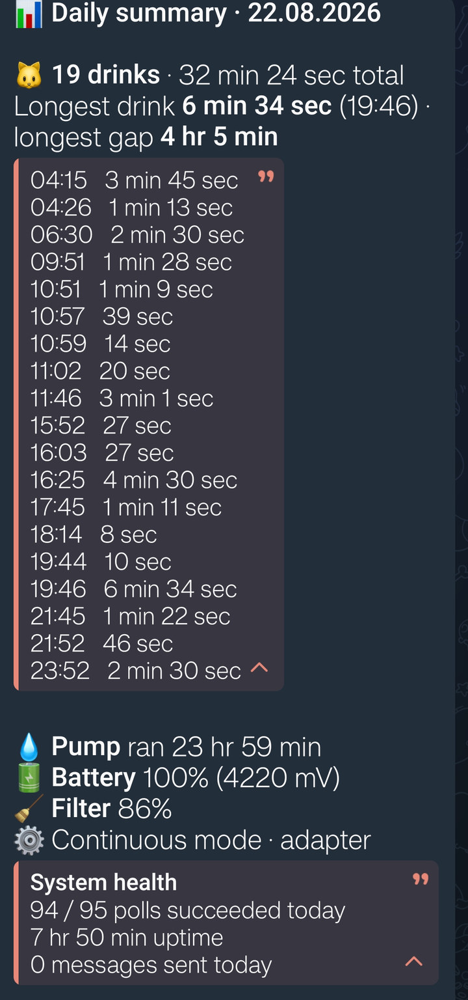
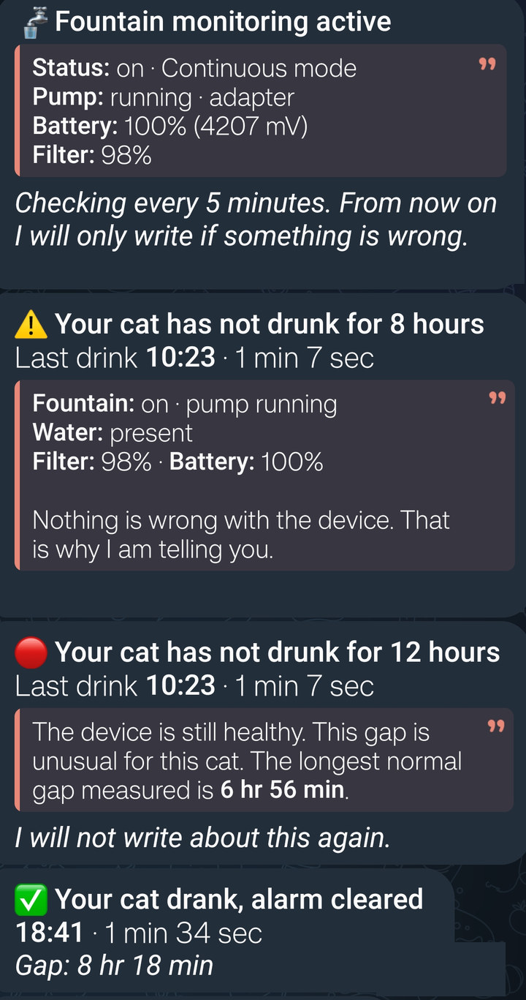
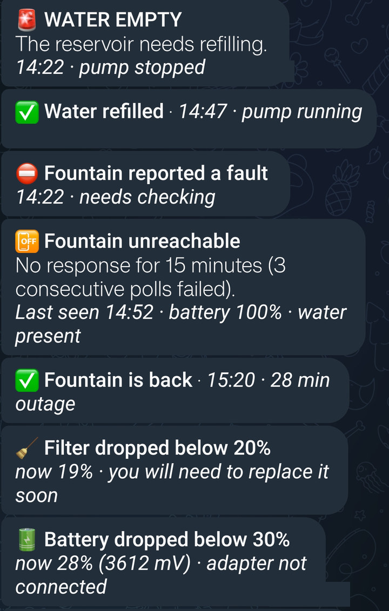

# PetKit Eversweet Max 2 UVC: local BLE → Telegram gateway

[](https://github.com/sakirsek/petkit-eversweet-ble-gateway/actions/workflows/tests.yml)

Monitors a PetKit water fountain **entirely locally**, with no PetKit cloud, no
account and no WiFi relay device, and sends Telegram alerts when something is
worth your attention.

The fountain is BLE-only. PetKit's architecture expects a second, WiFi-capable
PetKit device to act as a relay. This project replaces that relay with a €4
**ESP32-C3 SuperMini** running 24/7. The Python driver in this repo is the
prototype the firmware logic was validated on, and it also runs as the gateway
itself on any machine with Bluetooth: Windows, Linux, macOS or a Raspberry Pi.

> **Unofficial.** Not affiliated with, endorsed by, or connected to PetKit. All
> trademarks belong to their owners. This talks to a device you own, over your
> own radio, and reads your own data.

---

## Before you start

Read this part. It will save you the disappointment.

- **You need your fountain's auth secret**, and getting it currently requires an
  **Android phone with the PetKit app** plus `adb`. There is a script that does
  it in one command, but there is no known iOS route. See
  **[docs/secret.md](docs/secret.md)**.
- **Tested on exactly one model**, the Eversweet Max 2 UVC (`CTW3UV`), against
  one fountain. Other PetKit fountains use related but different frames.
- **The fountain accepts one BLE connection at a time**, and while the PetKit
  app is connected it stops advertising entirely, so the gateway cannot see it at
  all. In practice this is fine (the gateway holds the radio for a few seconds
  every five minutes) but you cannot sit in the app and expect polling to work.
- **This project is read-only by design.** It never changes a setting, never
  turns the pump on or off, and never consumes a history record. It does answer
  the history stream's flow control (`CMD 67`), because the fountain hands over
  one 512-byte chunk of 85 records and then refuses to send more until it is
  answered, so a reader that stays silent goes blind once the backlog passes
  85. Answering costs nothing: measured, the pending counter does not move.
  `CMD 69` is what retires records and this gateway never sends it, so the
  PetKit app keeps its full history. See
  [Reading the drinking history](docs/protocol.md#reading-the-drinking-history).

---

## What it does

Every 5 minutes it connects, reads the state, pulls the fountain's **own drink
history**, disconnects, and then **stays silent**. It sends a message only for:

| Trigger | Rule |
|---|---|
| 🚨 Water empty / device fault | immediately, plus a "cleared" message |
| 📴 Unreachable | after 15 min / 3 failed polls, plus "is back" |
| 🔋 Battery · 🧹 Filter thresholds | 30/20/10% and 20/10/5%, once per threshold |
| ⚠️ Thirst alarm | no drink for 8 h → escalates at 12 h → cleared when the cat drinks |
| 📊 Daily summary | just after midnight: visit list + system health receipt |

**There is deliberately no routine "the cat drank" message.** The valuable
signal is the *absence* of drinking. A cat that stops drinking is an early sign
of kidney or urinary trouble. Reporting every individual visit produces alert
fatigue and buries the one message that matters.

The threshold came from measurement, not intuition, and it has already been
re-tuned once. On 19 August the cat's longest normal gap was 3 h 40 min, so the
first setting was 6 hours. On 20 August the cat slept through the afternoon and
went **6 h 56 min** without drinking, in perfect health. A 6-hour threshold
would have fired a false alarm. It is now 8 hours, with `normal_gap_minutes` at
416. The daily report prints that day's longest gap, which is the only reason
the re-tuning was possible. **Expect to tune this for your own cat.**

### What the messages actually look like

This is a real report from the board, not a mock-up. One night, one cat,
reconstructed from the fountain's own history. The visit list sits behind an
expandable quote so the message stays short without losing anything, and the
system health receipt at the bottom is there so a quiet day still proves the
gateway was awake.



The alarm the whole project exists for, from the startup banner through to the
all-clear:



Note what the alarm says: *nothing is wrong with the device, that is why I am
telling you.* Note also that the escalation promises to stop talking, and then
does. An alarm that repeats itself is an alarm you learn to ignore.

Everything else it can send. Each problem has a matching all-clear, so you are
never left wondering whether something resolved itself:



That is the complete set. Fourteen message types, and on a normal day you get
exactly one of them: the summary.

### Try it with no fountain, no phone and no bot

```bash
make -C core && python tools/demo.py
```

That replays the six-hour capture in `data/` through the real core and prints
what it would have sent. It needs no configuration and no hardware.

It is also a check on the project's own claims. The capture holds raw detection
edges; the demo merges them with the rule reverse-engineered from the vendor
app, and gets **five visits with a longest gap of 3 hr 40 min**, which is what
the app's own history screen showed for that night and the number quoted further
down this README. Nothing is fitted to make the demo look good.

Once you do have a bot, `python preview_messages.py` sends one of every message
type to your own phone.

---

## Quickstart

### 1. Get your secret

```bash
# Open the PetKit app, connect to the fountain, wait ~10 s, then:
python tools/get_secret.py
```

This writes `config.json` with your `secret` and `mac` filled in. It does not
print the secret. If it cannot find anything, [docs/secret.md](docs/secret.md)
covers every fallback.

### 2. Run it on a PC first

Build the core first. It is plain C99 with no dependencies, and the same file
compiles into the ESP32 firmware unchanged.

```bash
make -C core                  # Linux, macOS, Raspberry Pi
```

```bat
core\build.bat                REM Windows; finds MSVC by itself via vswhere
```

Then:

```bash
pip install -r requirements.txt   # bleak, for the BLE transport
python test_core.py               # 141 regression tests, all must pass
python petkit_pc.py --once        # single poll, print result, exit
python petkit_pc.py               # run the gateway
```

`test_core.py` needs no configuration and no hardware: every expected value in
it was captured from a real device. If it passes, your build is good.

`python replay_logs.py` re-runs recorded days through the core.

### 3. Move it to the board

**There is nothing to wire.** No soldering, no breadboard, no sensors, no
resistors. An ESP32-C3 SuperMini and a USB-C cable is the entire bill of
materials. Flash it, then plug it into any USB charger within Bluetooth range
of the fountain and leave it there.

```bash
python esp32/tools/gen_secrets.py   # config.json -> esp32/main/secrets.h
cd esp32 && idf.py -p COM3 flash
```

Use a cable that carries data. A charge-only cable powers the board perfectly
well but will not show up as a serial port, which looks exactly like a dead
board. This wasted an hour here.

Only `petkit_pc.py` is replaced on the board (NimBLE + `esp_http_client`).
`core/` ships unchanged, which is why all the logic, including the message
wording, lives there rather than in Python.

### Configuration

Copy `config.example.json` to `config.json` and fill it in.

| Key | Default | Notes |
|---|---|---|
| `mac` | n/a | fountain BLE address |
| `secret` | n/a | 6-byte device secret as 12 hex chars (**sensitive**) |
| `telegram_token` / `telegram_chat_id` | n/a | bot credentials (**sensitive**) |
| `wifi_ssid` / `wifi_password` | n/a | **board only** (**sensitive**). The PC driver ignores them; `esp32/tools/gen_secrets.py` reads them so credentials live in exactly one file. A non-ASCII SSID must reach the firmware as octal escapes, not raw bytes. See that script |
| `poll_minutes` | 5 | |
| `thirst_hours` | 8 | raised from 6 after a healthy 6 h 56 min gap |
| `thirst_escalate_hours` | 12 | |
| `normal_gap_minutes` | 416 | longest normal gap measured, quoted in the escalation |
| `report_time` | n/a | **inert.** Kept only so the config layout stays valid. See below |
| `report_settle_minutes` | 3 | how long past midnight to wait before closing the day |
| `timezone_offset_hours` | 3 | **fixed** offset the core uses for every local time. Not read from the OS; the core never calls `localtime()`, so the PC and the board agree exactly. A DST country would need real zone handling |

`config.json` and `esp32/main/secrets.h` are gitignored. Keep it that way, and
if you fork this repo, run `python tools/check_leaks.py` before every push. It
reads your real values and refuses if any of them appear in what git is about to
publish. It has caught two genuine leaks in this repo already, including one in
a template file.

---

## Safety

The fountain has commands that do permanent damage. This project never sends
them, and there is a **whitelist in the transport layer of both drivers** so
that nothing outside the read-only set can go out even by accident
(`cmd_is_allowed()` in `esp32/main/pk_ble.c`, `ALLOWED_CMDS` in `petkit_pc.py`).

| Command | What it does |
|---:|---|
| **73** | Permanently rewrites deviceId + secret. **Can lock the official app out of your own fountain.** Only a physical factory reset undoes it. |
| **69** | Stream **end** acknowledgement. This is the one that retires records so the app can never show them again. Never sent here. |

`CMD 67` is the one frame that leaves this whitelist, from `send_chunk_ack()`,
and only when a read comes back short. It is the stream's flow control rather
than a cleanup command, and there is no way past 85 unread records without it.
Answering it consumes nothing: the pending counter was read either side of
three acknowledgements on the same connection and did not move.

If you build your own tool from [docs/protocol.md](docs/protocol.md), please
keep the rest of those rules.

---

## Layout

```
core/petkit_core.{h,c}   Pure C99 core, ships to the board as-is
                         protocol, decoding, alarm rules, message text
                         no malloc, no files, no sockets, no time()
core/Makefile            Builds the core on Linux, macOS and the Pi
core/build.bat           Builds the core on Windows (MSVC, found via vswhere)
pk.py                    ctypes bindings (pk_t kept opaque via pk_sizeof)
petkit_pc.py             PC driver: BLE (bleak) + Telegram + clock + logging
test_core.py             141 regression tests, all from live measurements
preview_messages.py      Sends every message type to Telegram for review
replay_logs.py           Replays a recorded run through the core
tools/demo.py            Replays data/ through the core. No hardware needed
tools/get_secret.py      Recovers your auth secret from the PetKit app's logs
tools/check_leaks.py     Refuses to let your secrets reach GitHub. Run it before
                         every push; it has caught two real leaks already
tools/check_style.py     Enforces the prose rules below. Runs in CI
requirements.txt         bleak, needed by the PC driver only
.github/workflows/       CI: builds the core and runs the suite on Linux,
                         macOS and Windows
esp32/                   ESP-IDF v5.5 firmware (NimBLE)
docs/protocol.md         The reverse-engineered BLE protocol
docs/secret.md           How to obtain your fountain's auth secret
data/                    Overnight baseline capture used to pick the
                         thresholds, with its own README describing the format
```

**Language choice:** ESP-IDF + C with **NimBLE** (roughly 40 KB less RAM than
Bluedroid). The 5-minute duty cycle means the BLE link is always closed before
the WiFi/TLS stack opens, so the two never contend for heap, the reason this
fits comfortably on a C3.

---

## Design notes that cost real time

The protocol itself is in **[docs/protocol.md](docs/protocol.md)**. These are
about the gateway's own logic, and every one of them was learned the hard way.

**The daily report is driven by polls, so it cannot depend on a timestamp.**
A wall-clock report time is a one-minute window and polls are five minutes
apart, so four runs out of five never observe it at all. The report is instead
defined as *the first tick at or after `report_settle_minutes` past midnight*,
and that is the only place a day is ever closed. It is dated to the day it
covers, not the day it was sent. This cost a full run of silent no-reports
before it was found. `report_time` and `CONFIG_REPORT_HOUR`/`_MIN` are inert.

**The day is not closed until `report_settle_minutes` past midnight.** The
fountain writes each record about 40 seconds after the visit ends, so a drink at
23:59 is not readable until just after midnight. Closing the day at the first
tick after midnight would leave that drink in no report at all: it belongs to
the finished day, whose summary has already gone out.

**⚠️ Never add a second way to close the day.** There used to be one, and it
looked harmless: a branch that fired when a tick landed inside the 23:59 minute,
four minutes earlier than the rollover. It stamped `last_report_day` itself,
which made the rollover's guard false, so the settled report never ran and
`report_settle_minutes` went inert on exactly the nights it was written for.
Every drink still unreadable at that tick then appeared in **no report at all**.

It did not miss at random, which is what made it dangerous. 86400 is an exact
multiple of the poll interval and both drivers sleep the remainder, so a run
holds its poll phase for its whole life: **one gateway start in five lands in
that minute and then loses the end of every single day until something restarts
it.** It surfaced because the board's first self-sent report arrived at 23:59
instead of just after midnight. That was the only visible symptom, visible only to
someone who knew the report was supposed to be late. The 101-test suite passed
throughout: the test covering the settle wait drove polls on `:00:30`, which
never observes 23:59. Test 19 now pins the property that actually matters:
*the same day seen through two poll phases must produce the same report.*

**An alarm you take back is worse than no alarm.** The thirst alarm used to
fire at the first poll where `now - last_drink >= 8 h`. But the fountain writes
each record about 40 seconds after the visit ends (budgeted at two minutes) and
we only look every five minutes, so at that first poll the cat may already have
drunk and there is no
way to know it yet. The whole five minutes after the threshold was a
false-alarm window. On 26 Aug 2026 it landed there: last drink 07:41,
threshold 15:41, the cat drank at 15:43, the poll ran at 15:43:40 with the
record not yet written. The alarm went out at 15:44 and was retracted at 15:49.

The alarm was not wrong about the past, it was asked before it could know. The
condition is now *"has it been 8 hours **and** would a drink that ended the dry
spell already be visible to me"*, which adds `poll_sec + 120 s` of grace. That
costs one extra poll on an eight-hour dry spell, which is nothing, and it does
not close the window completely: a drink in the final two minutes before the
poll is still unreadable, and no arithmetic here can fix that. What it removes
is the five-minute-wide part, which is the part that is actually wide.

**A receipt that lies is worse than no receipt.** The system health block
reported `0 messages sent today` on every report the gateway ever sent,
including days it had sent four. `day_messages` was reset at midnight and
printed, but nothing incremented it.

The fix carries two traps. The platform layer throws away the startup poll's
alarms, because a fountain that was already empty before we booted is not
news; counting at queue time would make the receipt claim a message nobody
received, so discarding now goes through `pk_msg_drop`, which un-counts what
it drops. `pk_msg_clear` remains the drain-after-sending path and must not be
used for the startup swallow. And the line now says **alerts**, not messages:
the startup banner is written and sent by the platform layer without ever
passing through `msg()`, and the report is read before it counts itself, so
"messages" would have been short by one on every day the gateway rebooted.
Name the number after what it can actually count.

**Do not clear the visit list at midnight.** The device replays every
unacknowledged record on the next poll, so cleared records come straight back
and get counted as today's. The list is a rolling multi-day window instead,
pruned at 48 h, and the report filters it by civil day. It is also written to
NVS every cycle, because the fountain's buffer is a recovery aid rather than
storage: the phone app drains it whenever it syncs, and a power cut must not
be able to lose a day. The upside is free restart recovery: a
gateway restarted at noon still produces a complete report for that day,
**as long as nothing else has drained the buffer first.**
The phone app acks when it syncs, which consumes those records for everyone.
See "The buffer is shared" in [docs/protocol.md](docs/protocol.md). The real
fix is for the gateway to persist its own visit list, which it does not do yet.

### Telegram formatting rules

Measured on a real phone; regressing these makes the messages worse.

- **Never use `<pre>`.** Telegram attaches a "COPY CODE" button and the
  space-based alignment drifts on mobile.
- Use `<blockquote>`, and `<blockquote expandable>` for long lists so the
  message stays short but stays complete.
- Align with `<b>bold labels</b>`, not padding spaces. Exception: a pure numeric
  column (time + duration) aligns fine because digits are equal width.
- Never put emoji inside an aligned block; they are double width.
- **No litre estimate.** The pump recirculates the same water rather than
  consuming it, so a "70 L" figure reads as the amount the cat drank and is
  actively misleading. Pump runtime is the honest number.
- **One fact per line in the report body.** Battery and Filter shared a line
  once and wrapped mid-value on a phone, splitting "Filter 96%" across two lines.
- **No em dashes.** Use `·` as a separator, a colon, or a full stop. Test 17
  fails if any generated message contains one, and `tools/check_style.py`
  fails in CI if one appears anywhere else in the repository, along with any
  non-English text. Both rules are deliberate and both are enforced.

---

## Status

**Verified.** The core passes 141 regression tests, every expected value taken
from live captures. The daily visit count and durations reproduce the vendor
app's own history screen exactly, for every record the fountain still offers.
A first 18 h 37 min unattended run polled
223/223 times without a single BLE failure. The board has run the full loop on
its own (poll, decode, alert, daily report) and reconstructed a complete day
across a mid-day reboot purely from the fountain's buffer.

**Known gap.** Restart recovery from the fountain's buffer holds only while
the phone app has not synced in the meantime. On 23 Aug 2026 it had, and a
gateway that booted at 15:14 reported 8 of that day's 17 visits: the nine from
01:51 to 09:02 had already been acked away. Nothing is lost while the gateway
is running. The gateway does not yet persist its visit list across a reboot,
and that, not the buffer, is where the day should be kept.

**Not verified.** Multi-day soak behaviour. The 12-hourly SNTP re-sync has never
been observed. The thirst threshold rests on a handful of days of one cat. The
fountain's history buffer capacity is known only to be ≥ 19 records / ≥ 12 h.
`tools/get_secret.py` has completed a real end-to-end extraction (OnePlus
CPH2655 / Android 16 / `com.petkit.oversea`, and the secret it produced was
verified identical to the one in daily use); its missing-app path was checked
separately on a Xiaomi MI 8. That is two phones and one app build, so how far
it generalises is unknown.

Issues reporting either success or failure on **a different phone, a different
Android version, or a different fountain** are the most useful thing this
project can receive.

---

## Prior art

[`slespersen/PetkitW5BLEMQTT`](https://github.com/slespersen/PetkitW5BLEMQTT) and
[`aavdberg/ha-petkit`](https://github.com/aavdberg/ha-petkit) already cover parts
of this device family and are worth looking at, especially for Home Assistant.
What this repo adds is the **drinking-history stream**, the discovery that it can
be read **without consuming the records**, the full 42-byte state map including
the proximity sensor, and the app's visit-merging rule.

## License

MIT. See [LICENSE](LICENSE).
